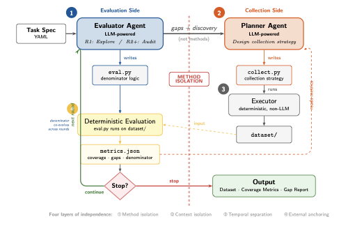
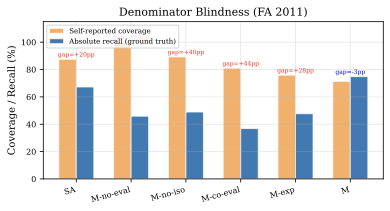
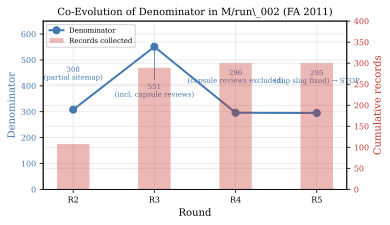

# Forage

**Solving Denominator Blindness in Autonomous Agents via Co-Evolving Evaluation**

[](https://arxiv.org/abs/TODO)
[](LICENSE)

Autonomous agents frequently terminate prematurely, reporting high coverage while missing large portions of the target. The root cause is **denominator blindness**: agents cannot accurately assess the total scope of an open-ended task, leading to overconfident self-evaluation against an underestimated denominator.

Forage is a minimal architectural principle for trustworthy autonomous self-assessment. An independent **Evaluator Agent** discovers and iteratively refines the definition of completeness (the denominator), while an architecturally isolated **Planner Agent** optimizes task execution (the numerator). Method isolation between the two agents prevents cognitive anchoring, and deterministic evaluation scripts ensure auditability.

<p align="center">
  
</p>

> In a 6-group ablation study across two benchmarks, agents without independent evaluation exhibit coverage gaps of up to **+84 percentage points** (self-reporting 100% at 15.9% actual recall). Full Forage achieves the highest absolute recall (**98.8%** and **74.8%**) with the most calibrated self-assessment (coverage gap of **-3pp**), at **3--4x lower cost** than single-agent baselines.

---

## The Problem: Denominator Blindness

When agents evaluate their own progress, they don't know what they don't know. A single agent might collect 2,000 records, self-report "100% coverage," and stop --- when the true total is 27,000. We call this **denominator blindness**: high self-reported coverage against an incomplete estimate of the data universe.

The concept draws from *denominator neglect* in behavioral economics (Sunstein, 2002), where human decision-makers fixate on absolute counts while ignoring base rates. In autonomous systems, this manifests as agents reporting high coverage against a denominator they never verified. Recent empirical evidence confirms this is pervasive: WideSearch (ByteDance, 2025) reports that state-of-the-art systems achieve only **5.1% completeness** on comprehensive information-seeking tasks, yet agents routinely self-report 85--100% coverage.

<p align="center">
  
  <br>
  <em>Coverage gap: the difference between self-reported coverage and actual recall (ground truth). Agents without independent evaluation (SA, M-no-eval) exhibit gaps of +29pp to +54pp.</em>
</p>

## Key Idea: Co-Evolving Evaluation

Existing systems treat evaluation criteria as a **static input** specified by humans before execution. Forage's evaluation criteria **co-evolve** with the collection strategy --- the Evaluator autonomously discovers, defines, and iteratively refines what "complete" means:

<p align="center">
  
  <br>
  <em>Denominator co-evolution in a representative run. The Evaluator's estimate evolves from an initial 308 (partial sitemap), through overcounting at 551 (including non-target content), to the correct 295 (ground truth) --- all without human intervention.</em>
</p>

| System | Evaluation criteria | Denominator |
|--------|:--:|:--:|
| AutoML / Chemical Self-Driving Labs | Fixed by human | Known a priori |
| autoresearch (`prepare.py`) | Fixed by human | Known (validation set) |
| AI-Scientist (reviewer rubric) | Fixed by human | Known (conference standards) |
| Scrapy, GPT Researcher | **None** | Not considered |
| **Forage** | **Co-evolves with agent** | **Discovered iteratively** |

This is possible because of **method isolation**: the Evaluator and Planner cannot see each other's code, preventing cognitive anchoring and enabling independent exploration.

## Architecture

Four layers of independence ensure trustworthy self-assessment:

1. **Method isolation** --- each agent's code is hidden from the other
2. **Context isolation** --- separate LLM calls, no shared reasoning
3. **Temporal separation** --- Evaluator defines the standard *before* Planner executes against it
4. **External anchoring** --- denominator grounded in verifiable external sources (sitemaps, API indices), not derived from collection results

The Evaluator writes `eval.py` (a deterministic Python script that computes coverage); the Planner writes `collect.py` (an executable collection strategy). Neither agent sees the other's code. The Executor runs both scripts without LLM involvement, ensuring auditability.

## Results

Six-group ablation study across two benchmarks:

### WhiteHouse.gov Announcements (GT = 1,695)

| Group | Recall | Precision | F1 | Cost | Coverage Gap |
|-------|:------:|:---------:|:--:|:----:|:---:|
| **M (Forage)** | **98.8%** | **100.0%** | **99.4%** | $4.79 | **-1pp** |
| M-no-iso | 97.7% | 99.8% | 98.7% | $4.16 | +2pp |
| SA (baseline) | 94.5% | 100.0% | 97.1% | $20.21 | N/A |
| M-no-eval | 78.9% | 97.8% | 84.8% | $4.91 | +21pp |
| M-co-eval | 68.2% | 99.9% | 78.1% | $2.93 | +32pp |
| M-exp | 30.2% | 95.3% | 45.8% | $7.72 | +70pp |

### Foreign Affairs Archive (GT = 295)

| Group | Recall | Precision | F1 | Cost | Coverage Gap |
|-------|:------:|:---------:|:--:|:----:|:---:|
| **M (Forage)** | **50.4%** | **69.5%** | **56.2%** | $3.51 | **+21pp** |
| M-no-iso | 48.9% | 61.7% | 46.3% | $4.03 | +40pp |
| M-exp | 47.7% | 49.5% | 47.7% | $3.89 | +28pp |
| M-no-eval | 45.9% | 33.3% | 36.3% | $4.32 | +54pp |
| M-co-eval | 36.8% | 53.4% | 43.0% | $2.38 | +44pp |
| SA (baseline) | 34.1% | 27.1% | 30.2% | $20.53 | N/A |

**Key findings:**
- **Method isolation** alone accounts for a **+25.9pp** recall improvement on the harder benchmark --- the single largest architectural contribution
- **Denominator blindness is real and measurable**: agents without independent evaluation exhibit coverage gaps of up to +84pp (self-reporting 100% at 15.9% actual recall)
- Forage costs **3--4x less** than single-agent baselines while achieving higher recall
- Co-evolving evaluation produces the **most calibrated** self-assessment (coverage gap of -3pp, slightly conservative)

## Generalization Beyond Data Collection

Denominator blindness is not specific to data collection. It is a general failure mode of any autonomous agent operating in an open-ended task space where the boundary of "done" must be discovered:

- **Scientific discovery.** An AI scientist exploring a chemical space does not know how many compounds with a desired property exist. Current systems optimize against fixed metrics, but never ask whether the search space itself has been adequately mapped.

- **Security auditing.** An agent conducting a vulnerability assessment does not know how many vulnerabilities exist. It may find five issues and report the system "thoroughly audited," unaware of entire attack surfaces it never examined.

- **Exploration and boundary problems.** Any agent tasked with mapping unknown territory faces denominator blindness: autonomous rovers exploring planetary surfaces, agents mapping network topologies, or systems conducting systematic literature reviews.

The deeper connection is to an epistemological question that pervades autonomous AI: **how can an agent establish reliable knowledge about the boundaries of what it does not know?** Forage contributes an architectural answer: separate the agent that *defines the boundary* from the agent that *operates within it*, ground boundary estimates in verifiable external sources, and allow boundaries to evolve as new information emerges.

## Installation

```bash
git clone https://github.com/Sariel2018/forage.git
cd forage
pip install -e .
```

### Prerequisites

- Python >= 3.11
- [Claude Code CLI](https://claude.ai/code) installed and authenticated (used as the LLM runtime)

## Usage

```bash
# Single run
forage run tasks/whitehouse_trump2.yaml --knowledge knowledge/

# Ablation experiment (multiple groups, 3 repeats each)
forage experiment tasks/whitehouse_trump2.yaml \
    --groups SA,M-exp,M,M-co-eval --repeats 3 --knowledge knowledge/
```

## Task Specification

Tasks are defined in YAML:

```yaml
task:
  name: "whitehouse_trump2"
  description: "Collect all White House announcements since Trump's 2nd inauguration"

target:
  topic: "White House presidential announcements and statements"
  time_range:
    start: "2025-01-20"
    end: "2026-04-01"

coverage:
  mode: "hard"
  target: 0.95

budget:
  max_rounds: 8
  max_runtime_minutes: 120
```

## Project Structure

```
forage/             # Core Python package
  core/             #   Outer loop, spec parser, tool definitions
  agents/           #   Evaluator, Planner, Executor agents
  experiments/      #   Experiment runner, single-agent baseline
tasks/              # Task specification YAML files
knowledge/          # Experience knowledge base
scripts/            # Analysis scripts (recall computation, figure generation)
tests/              # Unit tests
```

## Citation

```bibtex
@article{xie2026forage,
  title={Forage: Solving Denominator Blindness in Autonomous Agents via Co-Evolving Evaluation},
  author={Xie, Huaqing},
  journal={arXiv preprint arXiv:XXXX.XXXXX},
  year={2026}
}
```

## License

This project is licensed under the MIT License - see the [LICENSE](LICENSE) file for details.
